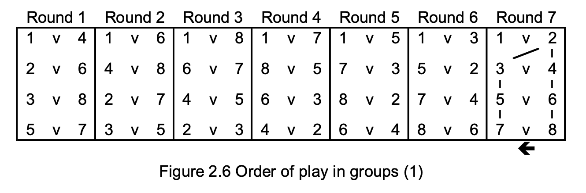

# Tournament Matches Ordering

[](https://github.com/weilsonwonder/tournament/actions/workflows/go.yml)
[](https://goreportcard.com/report/github.com/weilsonwonder/tournament)
[](https://pkg.go.dev/github.com/weilsonwonder/tournament?tab=doc)
[](https://snyk.io/test/github/weilsonwonder/tournament)

> An implementation of ITTF Tournament matches logic.
> 

## Contents

- [Installation](#installation)
- [Examples](#examples)
- [Changelog](#changelog)

## Installation

```
go get -u github.com/weilsonwonder/tournament
```

## Examples

Print out the matches between 6 players.
```go
package main

import (
	"fmt"

	"github.com/weilsonwonder/tournament"
)

type Player struct {
	Name string
}

func main() {
	// test players set
	players := []*Player{
		{"Alex"},
		{"Britney"},
		{"Charlie"},
		{"Darren"},
		{"Elizabeth"},
		{"Frank"},
	}

	// create a group where players will face-off
	group := tournament.NewGroup(len(players))

	// check number of rounds required to all players to face-off with each other
	fmt.Println("Total Rounds Required:", group.TotalRounds())
	fmt.Println("Total Matches:", group.TotalMatches())
	fmt.Println()

	// for each round, check out what is the matches like
	for round := 1; round <= group.TotalRounds(); round++ {
		matches := group.GetMatches(round)
		fmt.Println("Round", round)
		fmt.Println("---")
		for _, match := range matches {
			if match.IsValid() {
				fmt.Println(players[match.Player1].Name, "vs", players[match.Player2].Name)
			} else {
				// this is a null-match, which means one of the players do not have an opponent (when odd number of players)
				if match.Player1.IsValid() {
					fmt.Println(players[match.Player1].Name, "do not have a match")
				} else {
					fmt.Println(players[match.Player2].Name, "do not have a match")
				}
			}
		}
		fmt.Println()
	}
}
```

Output:
```
Total Rounds Required: 5
Total Matches: 15

Round 1
---
Alex vs Darren
Britney vs Frank
Charlie vs Elizabeth

Round 2
---
Alex vs Frank
Darren vs Elizabeth
Britney vs Charlie

Round 3
---
Alex vs Elizabeth
Frank vs Charlie
Darren vs Britney

Round 4
---
Alex vs Charlie
Elizabeth vs Britney
Frank vs Darren

Round 5
---
Alex vs Britney
Charlie vs Darren
Elizabeth vs Frank
```

Print out the matches between 5 players.
```go
package main

import (
	"fmt"

	"github.com/weilsonwonder/tournament"
)

type Player struct {
	Name string
}

func main() {
	// test players set
	players := []*Player{
		{"Zack"},
		{"Youth"},
		{"Xavier"},
		{"Wednesday"},
		{"Veronica"},
	}

	// create a group where players will face-off
	group := tournament.NewGroup(len(players))

	// check number of rounds required to all players to face-off with each other
	fmt.Println("Total Rounds Required:", group.TotalRounds())
	fmt.Println("Total Matches:", group.TotalMatches())
	fmt.Println()

	// for each round, check out what is the matches like
	for round := 1; round <= group.TotalRounds(); round++ {
		matches := group.GetMatches(round)
		fmt.Println("Round", round)
		fmt.Println("---")
		for _, match := range matches {
			if match.IsValid() {
				fmt.Println(players[match.Player1].Name, "vs", players[match.Player2].Name)
			} else {
				// this is a null-match, which means one of the players do not have an opponent (when odd number of players)
				if match.Player1.IsValid() {
					fmt.Println(players[match.Player1].Name, "do not have a match")
				} else {
					fmt.Println(players[match.Player2].Name, "do not have a match")
				}
			}
		}
		fmt.Println()
	}
}
```

Output:
```
Total Rounds Required: 5
Total Matches: 10

Round 1
---
Zack vs Wednesday
Youth do not have a match
Xavier vs Veronica

Round 2
---
Zack do not have a match
Wednesday vs Veronica
Youth vs Xavier

Round 3
---
Zack vs Veronica
Xavier do not have a match
Wednesday vs Youth

Round 4
---
Zack vs Xavier
Veronica vs Youth
Wednesday do not have a match

Round 5
---
Zack vs Youth
Xavier vs Wednesday
Veronica do not have a match
```

## Changelog

### [1.0.0] - 2024-08-11

- Added implementation
- Added tests and benchmarks
- Added readme
